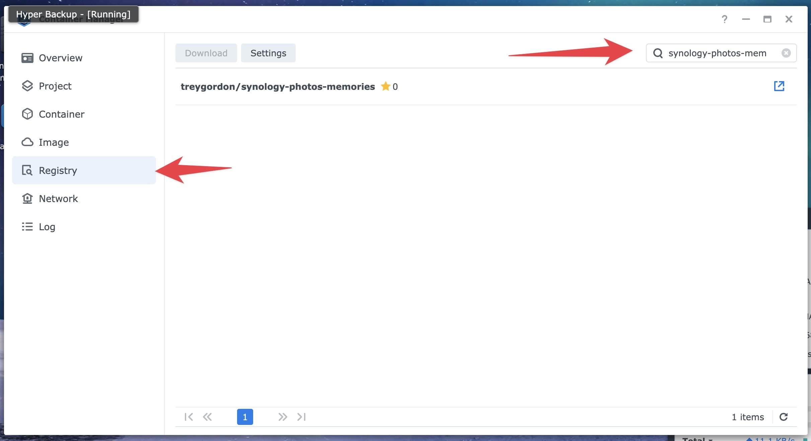
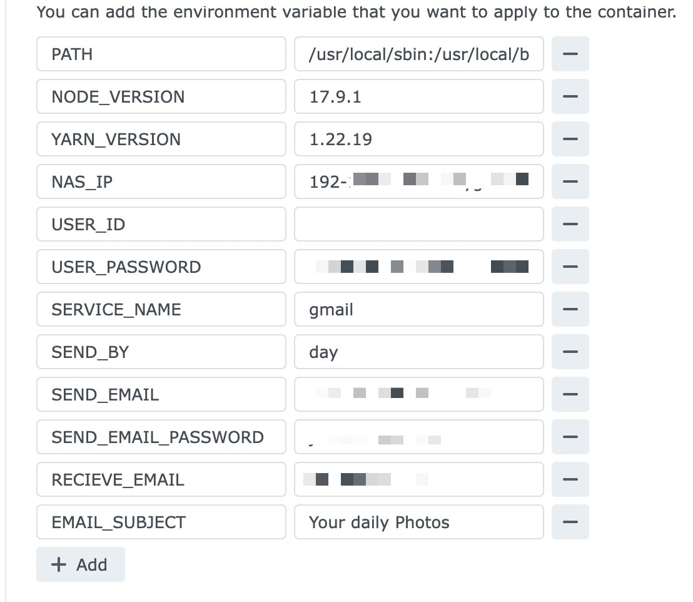

# Synology Photos Memories

This is a node JS/docker app that fills the void for synology photos lacking a memory feature similar to Google photos. The simple solution that I've found is to use the [unofficial api](https://github.com/zeichensatz/SynologyPhotosAPI) to fetch the photos in a given timeframe, and send an email with working web links to those photos.

## Hosting on your NAS

The easiest way to use this app would be to host it on your NAS using Docker

### DSM 7.2+

> **Warning**
If you have not setted up quickconnect, you should (as admin) in Control Panel -> Login Portal -> Applications and set the `photo` alias related to Synology Photos app.

To install with docker with Docker using the new container manager, use the following steps:

1. Search for, and download the the image from the Docker registry. Select the latest tag
   
2. Go to the image and click run
3. Change the container name if you prefer, and click next
4. Add the following ENV variables

#### Docker config

You'll need the following environment variables to run the image:

| Key                 | Value                                                    |
| ------------------- | -------------------------------------------------------- |
| NAS_IP              | yournasip.yourquickconnectid.direct.quickconnect.to:5001 |
| USER_ID             | MyID                                                     |
| USER_PASSWORD       | password123                                              |
| SERVICE_NAME        | gmail                                                    |
| SEND_BY             | month                                                    |
| SEND_EMAIL          | emailtosendfrom@gmail.com                                |
| SEND_EMAIL_PASSWORD | sendpassword123                                          |
| RECEIVE_EMAIL       | receiveemail@proton.me                                   |
| EMAIL_SUBJECT       | Your Monthly Photos                                      |

You shouldn't need to change any other settings.

#### NAS_IP:

This is the url you use to connect to quickconnect. Used to build the links in each email.

**Note** - this hasn't been tested with methods of NAS access outside quickconnect

#### USER_ID:

This is the ID you use to login to quickconnect

#### USER_PASSWORD:

Your password for quickconnect

#### SERVICE_NAME:

This the the service provider of the email you'll use for your memories to be sent from. Gmail is probably the easiest, but you may need to add an 'app password' to allow access if you have 'allow less secure apps' enabled in your settings.

You can do so at myaccount.google.com/apppasswords

Here's a list of the following services that are allowed for your send email: https://community.nodemailer.com/2-0-0-beta/setup-smtp/well-known-services/

#### SEND_BY:

This is how frequently you want a memory email. The options are 'day', 'week', or 'month'. For 'day', the email will be sent every morning at 8am. For 'week', the email will be sent every Monday at 8am. for 'month', it will be sent the first of every month at 8am.

#### SEND_EMAIL:

Your email with the same service provider you selected earlier that your memories email will be sent from.

#### SEND_EMAIL_PASSWORD:

The password for your send email (may require 'app password' for gmail).

#### RECEIVE_EMAIL:

The email address you want the memory emails delivered to. This can be any email address/service.

#### Email Subject

This can be anything you want.

---

Altogether, your env settings should look something like this:

5. Click done

---

Feel free to make a pull request or submit an issue if you see any mistakes!
